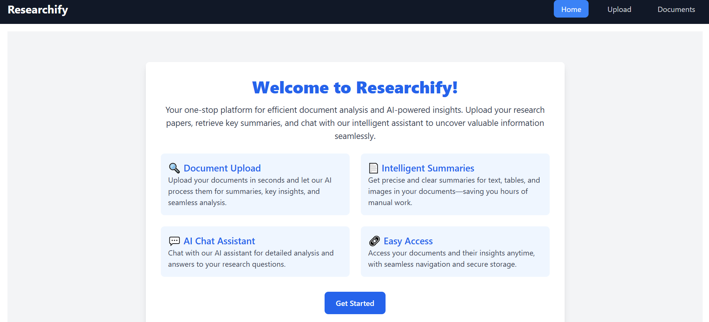
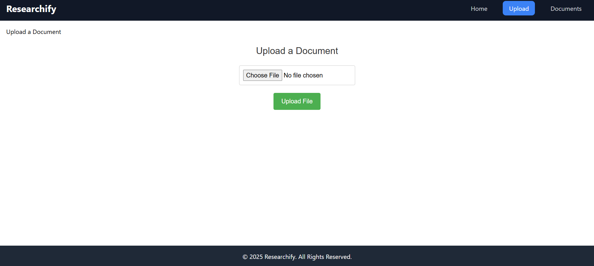
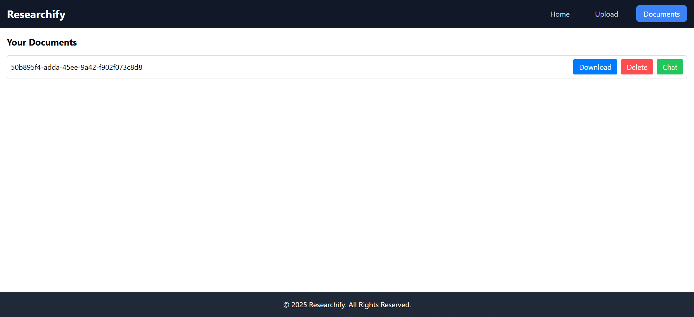
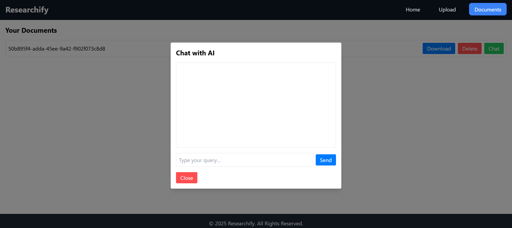

# **Researchify**

Researchify is a web-based application designed to simplify document management and analysis. It allows users to upload documents, process them for summaries, retrieve information using queries, and interact with the content through AI-powered chat. Built with a modern tech stack, Researchify ensures efficient, scalable, and user-friendly operations.

---

# Screenshots of Researchify

## Home Page

The home page provides an overview of Researchify's features with a clean and intuitive design.


## Upload Page

Upload documents seamlessly for processing and analysis.


## Documents Page

View all your uploaded documents, with options to download, delete, or chat with the AI.


## Chat Feature

Interact with the AI assistant for detailed analysis and insights on your uploaded documents.


## **Features**

### **1. Document Upload and Processing**

- Upload PDFs and process them for text, tables, and images.
- Extract and summarize content using AI-powered models.
- Store processed content securely in ChromaDB for efficient vector-based retrieval.

### **2. Document Management**

- View all uploaded documents with metadata.
- Download or delete documents directly from the interface.

### **3. AI-Powered Interaction**

- Query documents using natural language to retrieve relevant information.
- Chat with documents to explore insights interactively.

### **4. Modern UI/UX**

- Fully responsive interface built with **React** and **TailwindCSS**.
- Mobile-friendly design with a seamless navigation experience.

---

## **Tech Stack**

### **Frontend**

- **React (Vite)**: For building a fast, modular, and responsive user interface.
- **TailwindCSS**: For utility-first styling and responsiveness.
- **React Router**: For single-page application routing.

### **Backend**

- **Flask**: Lightweight and efficient backend framework.
- **ChromaDB**: Vector-based database for semantic search and document retrieval.
- **Python Libraries**:
  - **Unstructured**: For extracting and preprocessing PDFs.
  - **LangChain**: For managing AI models and vector operations.

### **API Testing**

- **Postman**: For testing and verifying API endpoints during development.

---

## **Setup Instructions**

### **1. Prerequisites**

Ensure you have the following installed:

- **Node.js** (for the frontend)
- **Python 3.9+** (for the backend)
- **pip** (Python package manager)
- **Virtualenv** (optional, for Python environment isolation)

---

### **2. Backend Setup**

1. Clone the repository:

   ```bash
   git clone https://github.com/yourusername/researchify.git
   cd researchify/backend
   ```

2. Create a virtual environment and activate it:

   ```bash
   python -m venv venv
   source venv/bin/activate  # On Windows: venv\Scripts\activate
   ```

3. Install the required Python libraries:

   ```bash
   pip install -r requirements.txt
   ```

4. Start the Flask server:
   ```bash
   flask run
   ```
   The server will be accessible at `http://127.0.0.1:5000`.

---

### **3. Frontend Setup**

1. Navigate to the frontend directory:

   ```bash
   cd ../frontend
   ```

2. Install dependencies:

   ```bash
   npm install
   ```

3. Start the development server:
   ```bash
   npm run dev
   ```
   The frontend will be accessible at `http://127.0.0.1:5173`.

---

## **Project Structure**

### **Backend**

- `/backend/app.py`: Flask application with API endpoints for upload, delete, retrieve, etc.
- `/backend/services/`: Contains modularized services for PDF processing, vector storage, and summarization.

### **Frontend**

- `/frontend/src/components/`: Contains reusable UI components like `TabBar`, `Footer`, and `Home`.
- `/frontend/src/pages/`: Includes page-level components like `Upload` and `Documents`.

---

## **API Endpoints**

### **1. Upload Document**

**`POST /upload`**

- **Description**: Uploads and processes a document.
- **Payload**:
  ```json
  {
    "file": "<PDF File>",
    "user_id": "guest_user"
  }
  ```
- **Response**:
  ```json
  {
    "message": "Document processed and stored successfully.",
    "file_id": "<unique-file-id>"
  }
  ```

### **2. List Documents**

**`GET /documents`**

- **Description**: Lists all documents for a specific user.
- **Query Parameters**:
  - `user_id`: User identifier.
- **Response**:
  ```json
  {
    "documents": [
      {
        "file_id": "<file-id>",
        "type": "pdf"
      }
    ]
  }
  ```

### **3. Retrieve Information**

**`POST /retrieve`**

- **Description**: Retrieves relevant content based on a query.
- **Payload**:
  ```json
  {
    "query": "What is attention mechanism?",
    "user_id": "guest_user",
    "file_id": "<file-id>"
  }
  ```
- **Response**:
  ```json
  {
    "results": [
      {
        "content": "Attention mechanism focuses on...",
        "metadata": { "type": "text" }
      }
    ]
  }
  ```

### **4. Delete Document**

**`DELETE /delete_file`**

- **Description**: Deletes a document by file ID.
- **Payload**:
  ```json
  {
    "file_id": "<file-id>",
    "user_id": "guest_user"
  }
  ```
- **Response**:
  ```json
  {
    "message": "File deleted successfully."
  }
  ```

### **5. Download Document**

**`GET /data/<file_id>/<filename>`**

- **Description**: Downloads the uploaded document.

---

## **Future Enhancements**

1. **Authentication**: Implement user authentication for added security.
2. **Chat Integration**: Build an interactive chat feature for querying documents.
3. **Analytics Dashboard**: Visualize insights from uploaded documents.
4. **Cloud Integration**: Store documents in cloud storage for scalability.

---

## **Contributors**

- **Amit Gupta** - Developer

---
